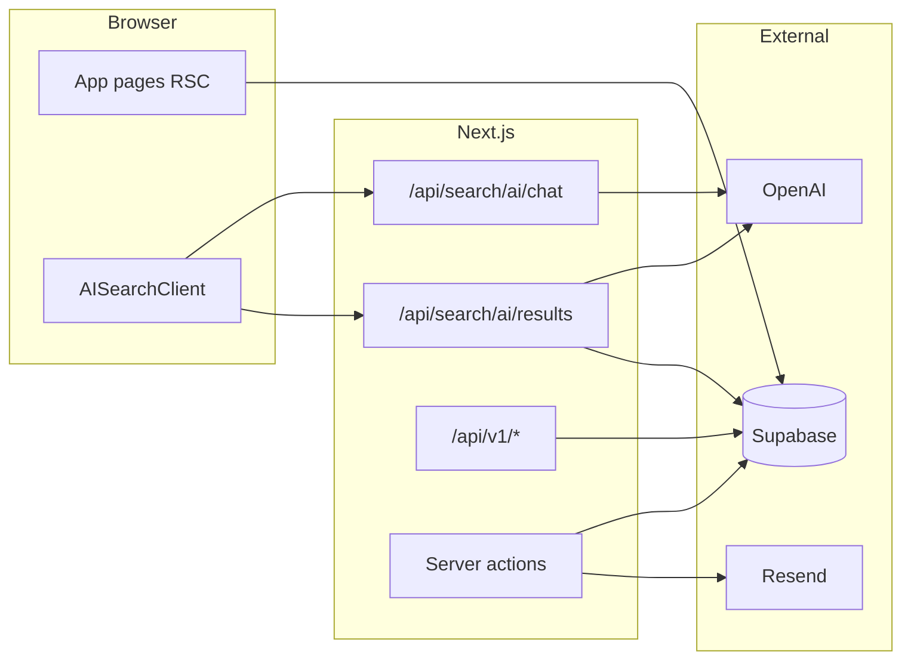

# Source Signal — product and architecture

Living reference for the **dataist** / Source Signal codebase: routes, data model, environment variables, styling conventions, and marketplace direction.

## Architecture

- **Framework**: Next.js 16 (App Router), React 19, TypeScript.
- **Data**: Supabase (Postgres, Auth). Server helpers: `lib/supabase/server.ts` (cookie session), `lib/supabase/client.ts`, `lib/supabase/admin.ts` (service role — server-only, privileged).
- **Session**: `middleware.ts` refreshes Supabase session via `lib/supabase/middleware.ts`.
- **Integrations**: OpenAI (`/api/search/ai/*`), Resend (company claim emails in `app/actions/claim-company.ts`).



## Data model (Supabase)

Core tables (see `types/database.ts` and `supabase/migrations/`):

| Area | Tables |
|------|--------|
| Users | `profiles` |
| Directory | `companies` |
| Taxonomy | `data_delivery_methods`, `data_attributes` |
| Reviews | `reviews` |
| Engagement | `user_bookmarks` |
| Claims | `company_claim_tokens` |
| Analytics | `ai_search_sessions` |

Marketplace / MCP skeleton (migration `013_marketplace_mcp_skeleton.sql`):

| Table | Purpose |
|-------|---------|
| `external_api_clients` | Future per-client API keys (hash storage); optional |
| `api_products` | Vendor API offerings (base URL, docs, auth type) |
| `connection_requests` | RFQ / connection intent stub |
| `datasets` | Public data atlas stub rows |
| `ai_connectivity_runs` | Automated AI probe runs |
| `ai_connectivity_metrics` | Per-run metrics |
| `ai_connectivity_scores` | Published AI connectivity scores |

Commerce and topics (migrations `014`–`018`):

| Table | Purpose |
|-------|---------|
| `organizations`, `org_members`, `org_api_keys` | Buyer orgs and per-org API keys (`ss_live_...`) |
| `marketplace_listings`, `marketplace_plans` | Published listings and pricing plans |
| `subscriptions`, `entitlements`, `usage_events` | Purchases → active access → metered usage |
| `vendor_credentials` | Vendor API credentials injected by the gateway proxy |
| `webhook_events` | Stripe webhook dedupe log |
| `vendor_interest_inquiries` | "Sell your data" form submissions |
| `vendor_stripe_connect`, `license_attestations`, `usage_daily_aggregates` | Payouts, license acceptance, usage rollups |
| `marketplace_topics`, `marketplace_listing_topics` | Topic taxonomy + listing tags (seeded in `018`) |

Seeded listings: **Census Data API** (`census-data-api`, migration `017`) and **WattBuy API** (`wattbuy-api`, migration `019`).

## Routes (web)

| Path | Description |
|------|-------------|
| `/` | Home: hero, reviews carousel, new vendors, how-it-works |
| `/companies` | Vendor directory (category, subcategory, `q` search) |
| `/companies/[slug]` | Vendor detail, bookmarks, reviews, claim/edit links |
| `/companies/[slug]/review` | Submit review |
| `/companies/[slug]/claim`, `/verify` | Domain-email claim |
| `/companies/[slug]/edit` | Claimant profile edit |
| `/reviews` | All reviews |
| `/search/ai` | AI-guided vendor search |
| `/login` | Auth |
| `/dashboard-protected-routes` | User dashboard (reviews, bookmarks) |
| `/dashboard-protected-routes/profile` | Profile edit |

## HTTP API (machine clients)

Base path: **`/api/v1`**. Authenticate with header:

```http
Authorization: Bearer <MARKETPLACE_API_KEY>
```

| Method | Path | Description |
|--------|------|-------------|
| `GET` | `/api/v1/vendors` | List vendors; query `q`, `limit` |
| `GET` | `/api/v1/vendors/[slug]` | Vendor summary + human rating aggregates + latest AI score |
| `GET` | `/api/v1/vendors/[slug]/datasets` | Datasets linked to vendor (atlas stub) |
| `GET` | `/api/v1/vendors/[slug]/ai-score` | Latest AI connectivity score only |
| `GET` | `/api/v1/vendors/[slug]/api-products` | Registered API products for vendor |
| `POST` | `/api/v1/connection-requests` | Create connection / RFQ stub |
| `POST` | `/api/v1/api-products` | Register API product metadata (service role) |
| `POST` | `/api/v1/internal/probe-stub` | Record stub AI connectivity run + score |
| `GET` | `/api/cron/ai-connectivity-stub` | Cron stub probe; header `Authorization: Bearer CRON_SECRET`; query `company_slug` optional |

## Marketplace routes (web)

| Path | Description |
|------|-------------|
| `/marketplace` | Browse published listings (cards with price, access badge, topic filter via `?topic=`) |
| `/marketplace/[slug]` | Listing detail — plans, API product info, subscribe panel or vendor self-serve panel |
| `/marketplace/census-data-api/help` | Census API help page with live in-browser query tester |
| `/marketplace/sell` | "Sell Your Data With Us" form → email via Resend → DB record |

Marketplace UX notes:

- **Vendor self-serve listings** (`lib/marketplace-vendor-access.ts`): for listings where keys come from the provider (currently `census-data-api` and `wattbuy-api`), the listing page shows a "Get started" panel (`components/marketplace/VendorApiKeyPanel.tsx`) linking to the vendor's signup/docs instead of the plan/subscribe flow, and cards show an **Instant** badge.
- **Topics** (`lib/marketplace-topics.ts`): listings are tagged with topics (`TopicBadges`, `TopicFilterBar`); admin tagging via `/api/v1/admin/listings/[slug]/topics`.
- **Reviews ↔ Marketplace switch** (`components/vendor/VendorViewSwitch.tsx`): companies with a published listing get a tab switch between `/companies/[slug]` (reviews) and `/marketplace/[slug]` (listing), rendered on both pages.
- **Listing logos** (`lib/marketplace-listing-logos.ts`): public-folder fallback logos per listing slug when the company has no `logo_url`.

## Census demo API (server-side proxy)

| Method | Path | Description |
|--------|------|-------------|
| `GET` | `/api/census/places` | All US Census places (cached daily; long browser/CDN cache headers) |
| `POST` | `/api/census/query` | Poverty (B17001*) / homeownership (B25003*) rates by place and years, ACS 5-year |

Both use the server-only `CENSUS_API_KEY` (`lib/census-api.ts`); the tester UI is `components/census/CensusApiTester.tsx`.

## Commerce API (new routes)

| Method | Path | Auth | Description |
|--------|------|------|-------------|
| `POST` | `/api/v1/orgs` | Session | Create organization |
| `GET` | `/api/v1/orgs` | Session | List user's orgs |
| `POST` | `/api/v1/api-keys` | Session | Create org API key (`ss_live_...`) |
| `GET` | `/api/v1/api-keys` | Session | List org API keys |
| `DELETE` | `/api/v1/api-keys/:id` | Session | Revoke org API key |
| `GET` | `/api/v1/listings` | Public | List published marketplace listings |
| `GET` | `/api/v1/listings/:slug` | Public | Listing detail + plans |
| `POST` | `/api/v1/checkout-sessions` | Session | Create Stripe checkout (or free/vendor-direct) |
| `GET` | `/api/v1/entitlements` | Session or org key | List active entitlements for org |
| `GET` | `/api/v1/usage` | Session or org key | Usage summary for org |
| `POST` | `/api/webhooks/stripe` | Stripe signature | Handle payment events → activate entitlements |
| `GET/POST/…` | `/api/marketplace/v1/[productSlug]/[...path]` | Org key (`data:read` scope) | Gateway proxy to vendor API |

## Auth model

- **Admin env key** (`MARKETPLACE_API_KEY`): for internal routes, probes, and cron only. Not distributed.
- **Org API keys** (`ss_live_...`): issued per-org in Developer Hub. Scopes: `catalog:read`, `data:read`, `subscribe`. Stored as sha256 hash; full key shown once.
- **Session cookies**: Supabase Auth; used for web UI and commerce endpoints.

## MCP server

Package: **`mcp-server/`** (standalone Node project). Agents set `SOURCE_SIGNAL_API_KEY` to an org-scoped key.

Tools: `get_vendor_rating`, `search_vendors`, `list_vendor_api_products`, `request_connection`, `get_vendor_ai_connectivity`, `list_marketplace_listings`, `get_marketplace_listing`, `create_checkout_session`, `get_entitlements`, `get_usage`. See `mcp-server/README.md`.

## Environment variables

| Variable | Used by |
|----------|---------|
| `NEXT_PUBLIC_SUPABASE_URL` | Supabase client |
| `NEXT_PUBLIC_SUPABASE_ANON_KEY` | Supabase client |
| `SUPABASE_SERVICE_ROLE_KEY` | Admin client (claims, API v1 after key check) |
| `OPENAI_API_KEY` | AI search routes |
| `RESEND_API_KEY`, `RESEND_FROM_EMAIL` | Claim emails and RFQ notifications |
| `VENDOR_INTEREST_EMAIL` | Where "Sell Your Data" form inquiries are sent (defaults to `RESEND_FROM_EMAIL`) |
| `MARKETPLACE_API_KEY` | Admin-only env key for internal routes, probes, cron. **Not for external callers.** |
| `CRON_SECRET` | `/api/cron/ai-connectivity-stub` (optional) |
| `STRIPE_SECRET_KEY` | Stripe Checkout, subscriptions, webhook validation |
| `STRIPE_WEBHOOK_SECRET` | `/api/webhooks/stripe` — Stripe signature verification |
| `NEXT_PUBLIC_APP_URL` | Absolute base URL for Stripe redirect URLs and emails |
| `CENSUS_API_KEY` | Server-only key for `/api/census/*` and the Census API help page |

For the MCP server (set in `mcp-server/` env or agent config):

| Variable | Purpose |
|----------|---------|
| `SOURCE_SIGNAL_API_KEY` | Org-scoped `ss_live_...` key from Developer Hub (preferred for agents) |
| `SOURCE_SIGNAL_API_BASE` | Base URL of the Next.js app |
| `MARKETPLACE_API_KEY` | Legacy admin key (fall back if `SOURCE_SIGNAL_API_KEY` not set) |

## Styling conventions

- **Layout**: `mx-auto max-w-6xl px-4 py-10` for main pages; root `min-h-screen flex flex-col`.
- **Palette**: Primary `#2C4C5C`, dark `#1e3642`, mid `#6C8494`, surface `#B8BFC1`, accent `#d4a017`, error `#E05A48`. Mirrors `app/globals.css` CSS variables.
- **UI primitives**: `components/ui/Button.tsx`, `Card.tsx` — match existing hex / `var(--card)` usage.

## Related docs

- [MARKETPLACE_UTILITY_BACKLOG.md](./MARKETPLACE_UTILITY_BACKLOG.md) — prioritized marketplace UX follow-ups.
- `.cursor/rules/business-logic-rules.mdc` — product scope for agents.
