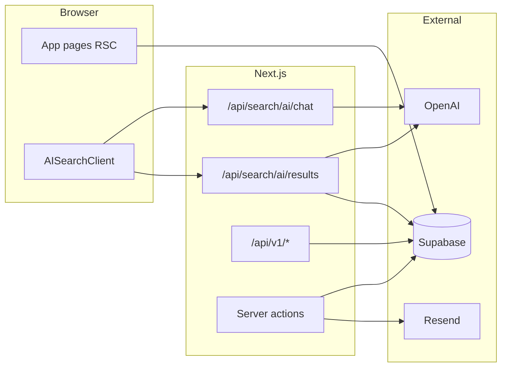

# Source Signal — product and architecture

Living reference for the **dataist** / Source Signal codebase: routes, data model, environment variables, styling conventions, and marketplace direction.

## Architecture

- **Framework**: Next.js 16 (App Router), React 19, TypeScript.
- **Data**: Supabase (Postgres, Auth). Server helpers: `lib/supabase/server.ts` (cookie session), `lib/supabase/client.ts`, `lib/supabase/admin.ts` (service role — server-only, privileged).
- **Session**: `middleware.ts` refreshes Supabase session via `lib/supabase/middleware.ts`.
- **Integrations**: OpenAI (`/api/search/ai/*`), Resend (company claim emails in `app/actions/claim-company.ts`).



## Data model (Supabase)

Core tables (see `types/database.ts` and `supabase/migrations/`):

| Area | Tables |
|------|--------|
| Users | `profiles` |
| Directory | `companies` |
| Taxonomy | `data_delivery_methods`, `data_attributes` |
| Reviews | `reviews` |
| Engagement | `user_bookmarks` |
| Claims | `company_claim_tokens` |
| Analytics | `ai_search_sessions` |

Marketplace / MCP skeleton (migration `013_marketplace_mcp_skeleton.sql`):

| Table | Purpose |
|-------|---------|
| `external_api_clients` | Future per-client API keys (hash storage); optional |
| `api_products` | Vendor API offerings (base URL, docs, auth type) |
| `connection_requests` | RFQ / connection intent stub |
| `datasets` | Public data atlas stub rows |
| `ai_connectivity_runs` | Automated AI probe runs |
| `ai_connectivity_metrics` | Per-run metrics |
| `ai_connectivity_scores` | Published AI connectivity scores |

## Routes (web)

| Path | Description |
|------|-------------|
| `/` | Home: hero, reviews carousel, new vendors, how-it-works |
| `/companies` | Vendor directory (category, subcategory, `q` search) |
| `/companies/[slug]` | Vendor detail, bookmarks, reviews, claim/edit links |
| `/companies/[slug]/review` | Submit review |
| `/companies/[slug]/claim`, `/verify` | Domain-email claim |
| `/companies/[slug]/edit` | Claimant profile edit |
| `/reviews` | All reviews |
| `/search/ai` | AI-guided vendor search |
| `/login` | Auth |
| `/dashboard-protected-routes` | User dashboard (reviews, bookmarks) |
| `/dashboard-protected-routes/profile` | Profile edit |

## HTTP API (machine clients)

Base path: **`/api/v1`**. Authenticate with header:

```http
Authorization: Bearer <MARKETPLACE_API_KEY>
```

| Method | Path | Description |
|--------|------|-------------|
| `GET` | `/api/v1/vendors` | List vendors; query `q`, `limit` |
| `GET` | `/api/v1/vendors/[slug]` | Vendor summary + human rating aggregates + latest AI score |
| `GET` | `/api/v1/vendors/[slug]/datasets` | Datasets linked to vendor (atlas stub) |
| `GET` | `/api/v1/vendors/[slug]/ai-score` | Latest AI connectivity score only |
| `GET` | `/api/v1/vendors/[slug]/api-products` | Registered API products for vendor |
| `POST` | `/api/v1/connection-requests` | Create connection / RFQ stub |
| `POST` | `/api/v1/api-products` | Register API product metadata (service role) |
| `POST` | `/api/v1/internal/probe-stub` | Record stub AI connectivity run + score |
| `GET` | `/api/cron/ai-connectivity-stub` | Cron stub probe; header `Authorization: Bearer CRON_SECRET`; query `company_slug` optional |

## MCP server

Package: **`mcp-server/`** (standalone Node project). Tools call the same `/api/v1` endpoints using `SOURCE_SIGNAL_API_BASE` and `MARKETPLACE_API_KEY`. See `mcp-server/README.md`.

## Environment variables

| Variable | Used by |
|----------|---------|
| `NEXT_PUBLIC_SUPABASE_URL` | Supabase client |
| `NEXT_PUBLIC_SUPABASE_ANON_KEY` | Supabase client |
| `SUPABASE_SERVICE_ROLE_KEY` | Admin client (claims, API v1 after key check) |
| `OPENAI_API_KEY` | AI search routes |
| `RESEND_API_KEY`, `RESEND_FROM_EMAIL` | Claim emails |
| `MARKETPLACE_API_KEY` | `/api/v1/*` and MCP |
| `CRON_SECRET` | `/api/cron/ai-connectivity-stub` (optional) |

## Styling conventions

- **Layout**: `mx-auto max-w-6xl px-4 py-10` for main pages; root `min-h-screen flex flex-col`.
- **Palette**: Primary `#2C4C5C`, dark `#1e3642`, mid `#6C8494`, surface `#B8BFC1`, accent `#d4a017`, error `#E05A48`. Mirrors `app/globals.css` CSS variables.
- **UI primitives**: `components/ui/Button.tsx`, `Card.tsx` — match existing hex / `var(--card)` usage.

## Related docs

- [MARKETPLACE_UTILITY_BACKLOG.md](./MARKETPLACE_UTILITY_BACKLOG.md) — prioritized marketplace UX follow-ups.
- `.cursor/rules/business-logic-rules.mdc` — product scope for agents.
